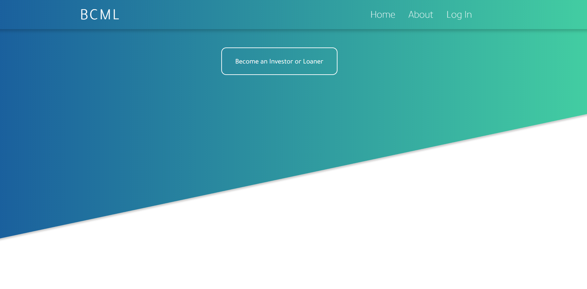
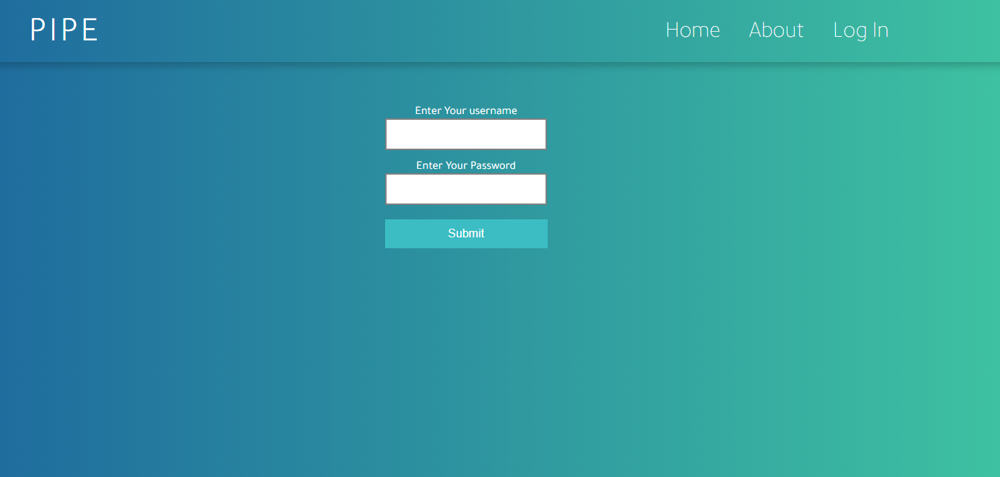
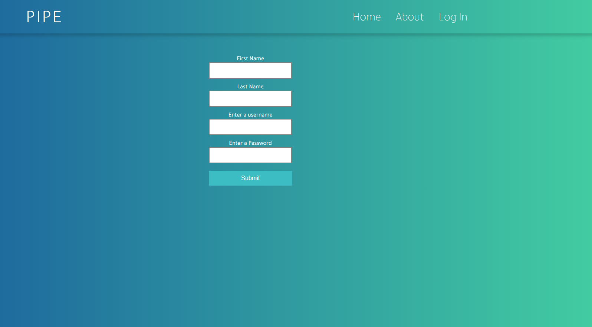
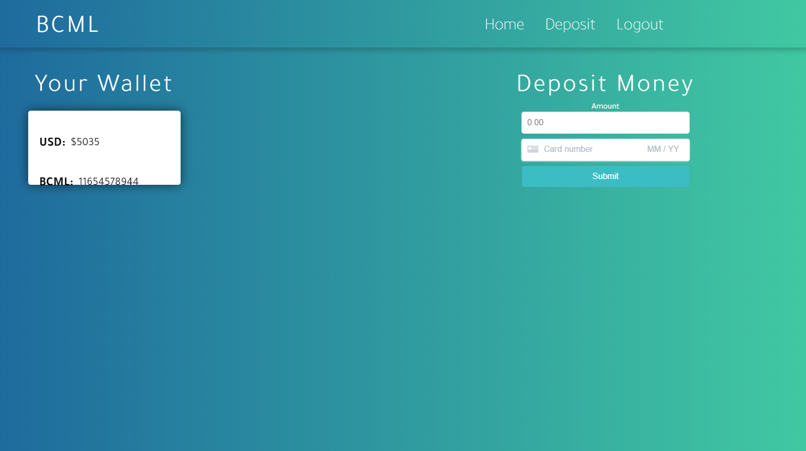
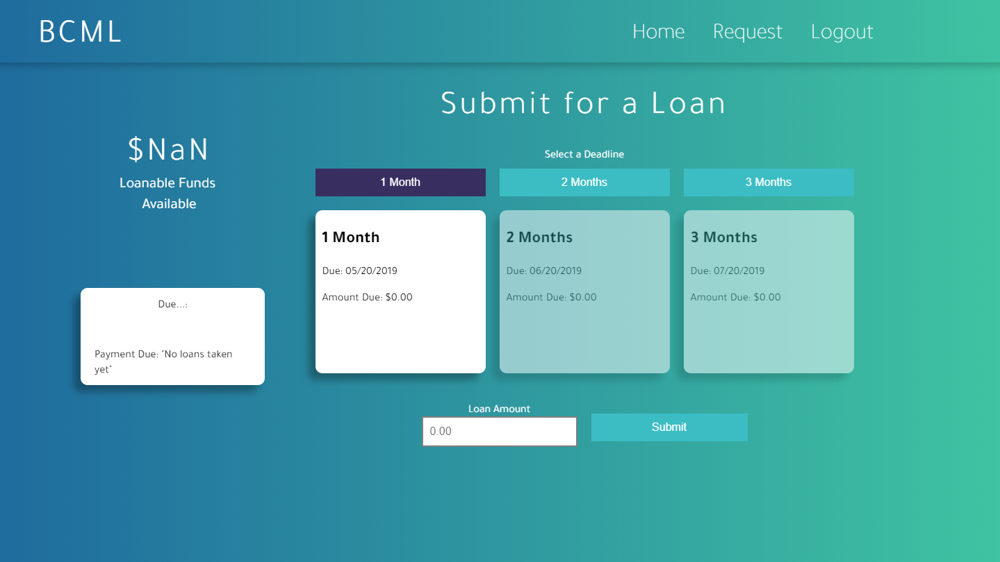

# BCML
- Microloaning platform with blockchain technology
- Built on top of Ark Coin

# Inspiration
Read about a farmer who received numerous microloans, still turned away by banks. He owned land and made money from his harvest. He was financially excluded, trapped in a debt repayment cycle.

# What it does
We help facilitate borrowers and investors get microloans. We store all transactions in a blockchain so there is a permanent record to hopefully build:

Unforgettable Credit Rating – user unable to erase credit history Certification System – other users testify if goal was achieved or not Fraud – disincentivised as will be apparent across network

# How we built it
Ark, Flask, Azure

# Challenges we ran into
Blockchain learning curve, web issues

# Accomplishments that we're proud of
We learned how to create our own blockchain using Ark and create a fairly decent platform

# What we learned
Blockchain and why microloans are important

# What's next for BCML
Possibilities are endless

# Demo imgs:

## Index:

## Login:

## Signup:

## Investor Platform:

## Loan Platform:

